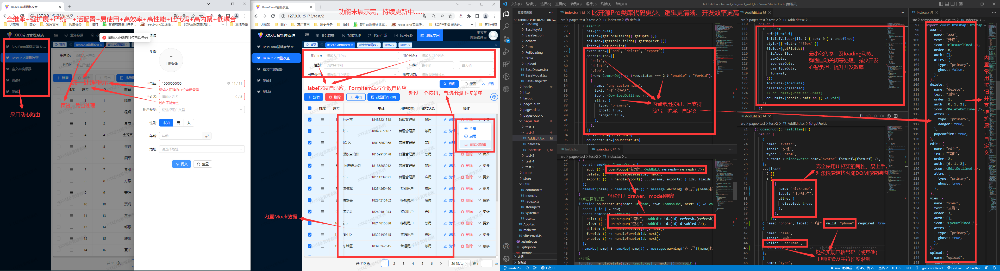

```js
// https://1583187609.github.io/quick_admin/react/preview/index.html
// https://1583187609.github.io/quick_admin/react/preview/index.html#/login

// https://1583187609.github.io/quick_admin/vue3/preview/index.html#/login
// https://1583187609.github.io/quick_admin/react/preview/index.html#/login
```

# Quick Admin React

## 一、工程简介

1. 技术栈：React18 + AntDesign + Less + TypeScript + Eslint + Prettier

## 二、地址链接

1. 在线预览  
   GitHub：[登录入口](https://1583187609.github.io/quick_admin/react/preview/index.html#/login)、[Vue 版](https://1583187609.github.io/quick_admin/vue3/preview/index.html#/login)  
   Gitee：[登录入口](https://fanlichuan.gitee.io/management/vue/#/login)、[Vue 版](https://fanlichuan.gitee.io/management/vue/#/login)
2. 说明文档  
   [GitHub](https://1583187609.github.io/quick_admin/react/docs/index.html)、
   [Gitee](https://fanlichuan.gitee.io/quick_admin/react/docs/index.html)

## 三、前言概述

### 特性：全继承 + 易使用 + 高内聚 + 低耦合 + 活配置 + 强扩展 + 低代码 + 高效率 + 严统一

- **全继承 + 易使用**：完全继承 ElementPlus 组件属性；命名语义清晰；免写基础逻辑；逻辑解耦……
- **高内聚 + 低耦合**：单一原则、细粒度化、灵活组合、可配置性。
- **活配置 + 强扩展**：内置常用属性、组件（支持自定义内嵌）；支持全局/页面/组件级值覆盖。
- **低代码 + 高效率**：只需专注纯业务逻辑、书写少量代码；高于行业平均效率（页面开发、接口联调、Bug 修复、迭代维护 <span style="color:red;">**各约 30% ~ 50%**</span>）。
- **严统一**：自动计算表单 label 宽、表格列宽；极致统一按钮风格（顺序、间距、样式）、表单校验。

## 三、前言概述

### 特性：全继承 + 易使用 + 高内聚 + 低耦合 + 活配置 + 强扩展 + 低代码 + 高效率 + 严统一

- **全继承 + 易使用**：完全继承 ElementPlus 组件属性；命名语义清晰；免写基础逻辑；逻辑解耦……
- **高内聚 + 低耦合**：单一原则、细粒度化、灵活组合、可配置性。
- **活配置 + 强扩展**：内置常用属性、组件（支持自定义内嵌）；支持全局/页面/组件级值覆盖。
- **低代码 + 高效率**：只需专注纯业务逻辑、书写少量代码；高于行业平均效率（页面开发、接口联调、Bug 修复、迭代维护 <span style="color:red;">**各约 30% ~ 50%**</span>）。
- **严统一**：自动计算表单 label 宽、表格列宽；极致统一按钮风格（顺序、间距、样式）、表单校验。

### 创新：

1. **简化表格列渲染**：

   - 内置表格列属性：宽度、未联调提示、占位符、……
   - 内置通用组件：图片（预览、空图、大小）、文本内容（超出省略、点击可弹窗查看全部）、标签（样式、文本）、……
   - 支持内嵌组件：例：UserInfo。

2. **简化按钮书写 & 统一样式风格 & 实现逻辑功能**：

   - 只需写入 add、Edit、delete、……，即可实现统一样式、位置顺序等（可覆盖）。
   - 轻松弹出 popover、popconfirm 提示。
   - 简单优雅实现按钮角色权限：只需按钮配置文件中设置一次，即可全局通用。

3. **轻松打开/关闭弹窗**：通过调用 openPopup、closePopup 实现。

4. **轻松实现表单检验**：设置表单字段的 valid 类型，例：phone、password、……

5. **免考虑基础逻辑**：

   - 增删改查免设置表格、表格列基础属性。
   - 表单字段 label 宽度自动计算、自动补全 placeholder 文本、按 enter 键或 change 事件触发搜索。
   - 按钮防抖、加载状态；统一图标、样式；免角色权限逻辑处理。
   - 免弹窗组件引入（dialog、drawer）、基础属性设置。
   - 新增/编辑提交后 —— 提示成功、关闭弹窗、刷新列表，通过简单的 next() 回调完成（可传参覆盖）。
   - ……

6. **封装弹性布局类**：提升静态页面开发效率 <span style="color:red;">**约 30%**</span> 。[点此了解弹性布局基础类（布局神器）](http://fanlichuan.gitee.io/produce/flex-layout/index.html)

## 四、图例简述

1. 简述：
   

## 五、特点

1. 待完善

## 六、支持

1. 待完善

## 七、其他后记

1. 以上文字说明、图片示例，未完全呈现已有功能，因时间精力有限，后续再完善此文档。
2. 自 2023-08-01 更新之后，由于工作生活繁忙，一直处于暂停中。
3. [Vue 版仓库地址](https://gitee.com/fanlichuan/management/tree/master/quick-admin-vue3)

## 八、联系方式

**微信**：fic3014  
**邮箱**：1583187609@qq.com
